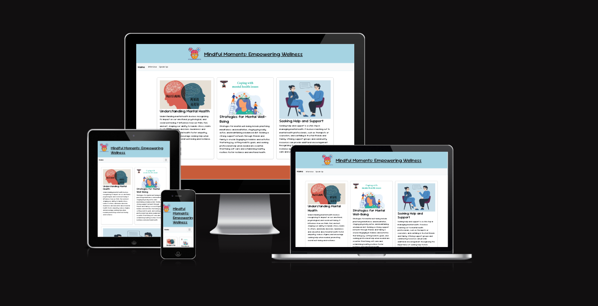

[Mental health logo](assets/images/icons8-mental-health-100.png)

Link to live site - https://luca-maxwell99.github.io/Project1/

# Mindful Moments 

Welcome to my Mindful moments website. The mission of this webapge is to provide resources, support, and information to help individuals understand and improve their mental health. Included are various related topics, a call to action, a form and a professional interview. I choose to do these things as it covers diffrent point of views of mental health  with the intension of helping a wide range of audiences. 

Due to some complicated problems I had during the assignment, I was unable to submit and present with the rest of the class. I was aware that it was importatnt that i didnt push or commit any more work on that repo. So this is my resubbmisson for project 1.  

 

## Reponsive

 

Thank you for visiting our website and supporting Mental Health Awareness.

## Wire frames 

 

## Credits

Image sources

https://www.psychowellnesscenter.com/Blog/coping-with-mental-health-issues

https://darrenbaine.com/breaking-the-stigma-understanding-mental-health/

https://peaceofmind4wellness.com/mental-health-matters-the-importance-of-seeking-professional-help/